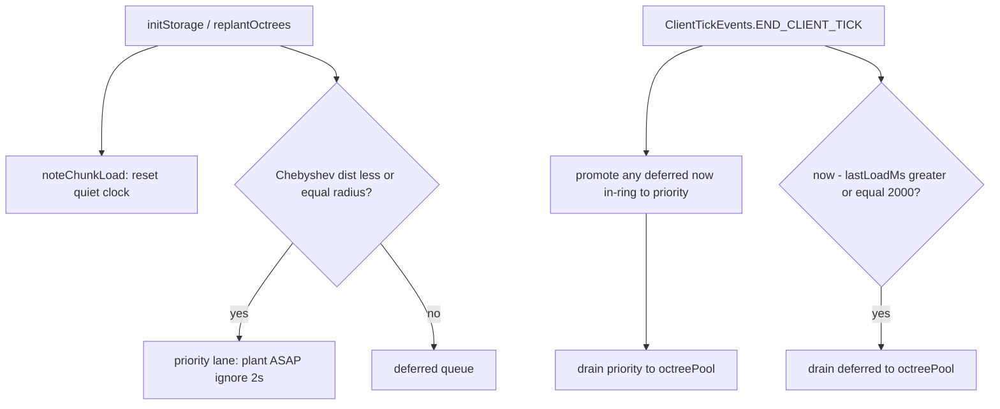

# Octree plant debounce and chunk-gen observation

## Status

- Commit done: `db60a3d` — children[8] + lazy `describe`.
- Debounce (section 2) ships now. Chunk-generation observation (section 3) stays deferred.

## 2. Debounce with in-ring priority (implement)

**Intent.** Plant inside the playable ring without waiting. Outside that ring, queue sections and only drain after **2s of consecutive client time with no chunk loads**. Any out-of-ring load still resets the quiet clock. Covers first join, teleport, and death/respawn.

**Ring definition (same metric everywhere).** Chebyshev chunk distance from the player’s current chunk:

```text
radius = pConfig.soundSimulationDistance + 2   // default 8+2 = 10
inRing ⇔ max(|dx|, |dz|) <= radius
```

Use this helper for load-time scheduling, priority promotion, and drain eligibility. Fallback if `pConfig` / player / world missing: treat as outside ring → deferred queue (safe during early init).

**Two lanes.**

| Lane | When | 2s quiet rule |
|------|------|----------------|
| **Priority** | Chunk loads (or is already queued) with `inRing` | **Ignored** — plant ASAP |
| **Deferred** | Chunk loads with `!inRing` | Must wait for 2s with no loads, then drain |

When an in-ring chunk loads, its sections go to the **front of the priority lane** (or submit straight to `octreePool`). They must not sit behind deferred backlog and must not wait for quiet. A dedicated priority drain each client tick (or immediate `octreePool.execute`) is enough; a separate thread is optional and not required if the existing pool already runs plants async.

If a deferred entry later becomes in-ring (player walks/teleports closer), **promote** it to the priority lane on the next tick (same distance helper) so it jumps the 2s wait.



**Where to gate.** [`WorldChunkMixin.initStorage`](repo/src/main/java/dev/thedocruby/resounding/mixin/WorldChunkMixin.java) and [`replantOctrees`](repo/src/main/java/dev/thedocruby/resounding/mixin/WorldChunkMixin.java) currently:

```java
OctreeManager.octreePool.execute(() -> OctreeManager.plantOctree(this, index, blank));
```

Route through `OctreePlantScheduler.schedule(...)` / `OctreeManager.schedulePlant(...)`.

**Coordinator (`OctreePlantScheduler`, owned by `OctreeManager`).**

- `noteChunkLoad()` — reset `lastChunkLoadMs` (every `initStorage`). Unload does not reset.
- `schedule(chunk, index, root)` — classify with shared `inRing(chunkPos)`; priority vs deferred.
- Deferred/priority entry: chunk pos + section index + `materialGeneration` + root. Drop if chunk gone or generation changed.
- `onClientTick()` — (1) promote deferred→priority when now in-ring; (2) drain priority (cap per tick); (3) if quiet ≥ 2s, drain deferred (cap per tick).

**Tick registration.** [`ModClient.onInitializeClient`](repo/src/main/java/dev/thedocruby/resounding/ModClient.java): `ClientTickEvents.END_CLIENT_TICK` → scheduler tick.

**Blank sections stay.** Outside-ring chunks still get blank `Branch` roots so raycasts do not NPE until planted.

**Tests.** Pure scheduler with injectable clock + player chunk + radius; cover in-ring immediate, out-of-ring waits for 2s, load resets quiet, promote-on-move.

**Out of scope here.** Chunk-generation proximity; config schema changes; server mixins.

## 3. Observe chunk generation (deferred)

**Reality check.** Octree work is client-only. True worldgen is server-side. Client `loadFromPacket` does not distinguish gen vs disk load.

**Later investigation.**

1. Fabric `ServerChunkEvents.GENERATE` (if on our API) vs `CHUNK_LOAD`.
2. Bridge to client (SP shared JVM or S2C) so plants near generating chunks pause even inside the ring.
3. Remote MP without server mod: keep load debounce only.
4. After quiet gen: resume priority + deferred rules from section 2.

Document findings in `CHUNK_GEN_HOOK.md` when that work starts; no code in this pass.
